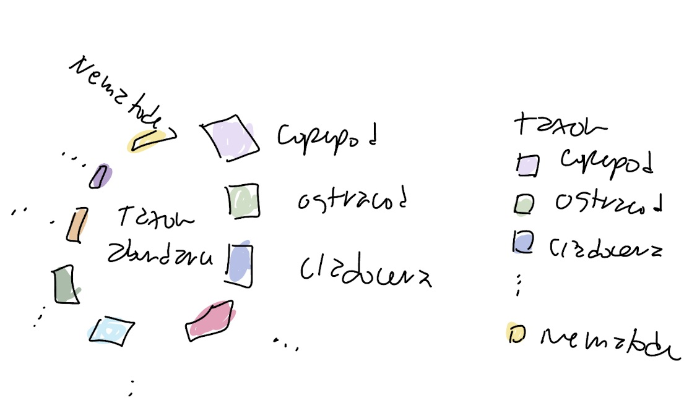

# Intermediate Elective 2

# General Information
This repository contains data and code to visualize aquatic abundance using someone else's code. 

# Data and file Information

```
.
├── README.md
├── code                                          
│   ├── R code.R               # inspiration code
│   └── intermediate-elective-2.pdf
|   └── intermediate-elective-2.qmd
├── data
│   ├── Aquatic Sampling Data-2026-03-10.xlsx     # invertebrate survey
│   └── taxon_list.csv                            # taxonomic information
|   └── plan.jpeg                                 # sketch
└── intermediate-elective.Rproj
```

# Rendered Output
This is a link to my rendered assignment pdf: [here](https://github.com/n921c/intermediate-elective/blob/main/code/intermediate-elective-2.pdf)

Here is my final visualization:

